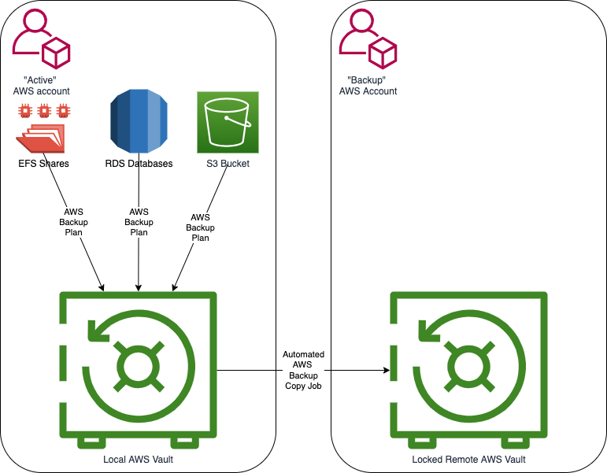

# Backup Solution outline document

## Summary
This document outlines the current solution in place to provide a "hardened" backup solution which aims to prevent and mitigate data loss and corruption due to "bad actors" and potential accidental scenarios.

## Solution overview

## Solution Description
### Overview
#### Supported asset types
AWS backup, the backbone of this solution, supports many different AWS asset types (see: https://docs.aws.amazon.com/aws-backup/latest/devguide/backup-feature-availability.html)

However we are actively using this system for the following asset types:
* S3 Buckets
* DynamoDB
* EFS
* RDS
* Parameter store (via a Lambda backing up to a S3 Bucket)

#### Backup
1. Each individual resource has its own CMK (Customer Managed encryption Key) which encrypts the resources data while at rest.
2. On a regular basis a snapshot is taken off that resource and placed in the the Local AWS Vault as a recovery point (a.k.a. a backup) which encrypts it data with its own CMK.
3. Once a local recovery point is in place in the local AWS Vault an AWS Backup "Copy Job" is automatically kicked off to make a copy of the recovery point into the Locked Remote Vault in the "Backup" AWS account.
4. When the recovery point is placed in the Locked AWS Vault it re-encrypts the recovery point with its own CMK. At this time a lifecycle policy is assigned to the recovery point in the Locked Remote AWS Vault
4. The recovery point can not be removed by ANYONE (including AWS support and the root user) until such time as the lifecycle expires the recovery point. See: https://docs.aws.amazon.com/aws-backup/latest/devguide/vault-lock.html

#### Restoration
The method for restoration of a resource will depend on the exact circumstances under which a restore is required. However the method will basically follow the following steps:

1. A privileged Platform Engineer logs into the "Backup" AWS account (via breakglass procedures) and selects the required restore point from the Locked Remote AWS Vault.
2. The engineer then selects to do manual copy job back to the Local AWS Vault. Normally the engineer would simply select to copy the restore point back to the original account, however it is possible to copy it to another account/region if required (for example in the case where the "Active" AWS account is felt to have been irretrievably compromised).
3. Once the restore point has been copied into the Local AWS vault the data can be restored. Typically for RDS this would mean creating a new RDS instance from the recovered snapshot (see: https://docs.aws.amazon.com/aws-backup/latest/devguide/restoring-rds.html) or for EFS resources you are able to either restore single files or the whole filesystem to a "restored" directory on the original EFS volume as the situation requires. (see: https://docs.aws.amazon.com/aws-backup/latest/devguide/restoring-efs.html)

#### Notes:
* All data in transit over the AWS network is TLS encrypted
* Access to the "Backup" AWS account is restricted to a few users, while a full access policy is being defined.
* Access to the separate "Backup" AWS account for production data is recorded following the current confluence model, while waiting on the new "breakglass" model.

## Limitations & Potential Future Improvements
### Limitations
#### RDS & Cros-regions
Currently due to a AWS feature limitation RDS snapshots can be copied to another region or to another account but not both. This is down to how AWS RDS snapshots currently handle KMS keys within regions. This means that the "Backup" AWS account currently has to be in the same region as the "Active" AWS account as is the case currently. See: https://docs.aws.amazon.com/aws-backup/latest/devguide/whatisbackup.html#features-by-resource

Unfortunately despite a feature request being already in place with AWS there is no timescale for this to be changed.

The workaround, if a separate region as well as a "Backup" AWS account is required, would be too setup a trigger for another AWS backup copy job which makes an additional RestorePoint in a Locked Vault in another region for the "Backup" AWS account. This of course would incur some additional cost.

If this is deemed an essential feature further details, including costs, can be provided upon request.

### Potential Future Improvements
#### Reporting
Reporting on backup is a currently available feature but has not been set up with the current solution.

It is strongly recommended that backup reporting should be done at the AWS Organisational level which will provide auditing of backups at a high and very independent level.

For more info see here: https://docs.aws.amazon.com/aws-backup/latest/devguide/aws-backup-audit-manager.html
